  Hono x MCP

  The default platform for MCPs

---
layout: two-cols
---

  
  
  

    
Aditya Mathur

    
Member of Technical Staff @Sentry

  

  
  

    <a href="https://github.com/mathuraditya724" class="social-link">
      <carbon:logo-github />
      mathuraditya724
    </a>
    <a href="https://x.com/mathurAditya7" class="social-link">
      <carbon:logo-x />
      mathuraditya7
    </a>
    <a href="https://bsky.app/profile/maditya.sh" class="social-link">
      <bi:bluesky />
      maditya.sh
    </a>
  

::right::

  

    Creating bugs for LLMs to fix
  

  
  

  Currently working on Spotlightjs, and other crazy ideas now and then.  
    You might know me from @hono/mcp, muppet, hono-openapi, hono-rate-limiter, etc.
  

---

  

  What is MCP?
  

  

    It's just a Server, which can connect LLMs with External Apps
  

---

  

    
The MCP Evolution

  

  

    

      

        
= 1 && $clicks < 2 ? '20%' : $clicks >= 2 && $clicks < 3 ? '40%' : $clicks >= 3 && $clicks < 4 ? '60%' : $clicks >= 4 && $clicks < 5 ? '80%' : '100%' }"
        >

      

    

    
= 1 }">
      

      

      <v-click at="1">
        
Nov - Dec 2024

        
Launch

        

          Experimentation phase, exploring the usecases and potential
        

      </v-click>
    

    
= 2 }">
      

      

      <v-click at="2">
        
Jan - Feb 2025

        
Just HTTP Wrappers?

        

          "Why do we need MCP when LLMs can use OpenAPI specs?"
        

      </v-click>
    

    
= 3 }">
      

      

      <v-click at="3">
        
Mar 2025

        
Growing Ecosystem

        

          OpenAI and Google joining, MCP frameworks, inspector and HTTP transport
        

      </v-click>
    

    
= 4 }">
      

      

      <v-click at="4">
        
Apr - Jun 2025

        
Official MCP Servers

        

          from Sentry, Cloudflare, Github, Supabase, Context7, etc
        

      </v-click>
    

    
= 5 }">
      

      

      <v-click at="5">
        
Now

        
Stability & New Ideas

        

          Standardizing Auth and Transport. Adding agent inside the MCP server
        

      </v-click>
    

  

---

### MCP Architecture

```mermaid
graph LR
    subgraph Clients["🖥️ Clients"]
        C1["Claude"]
        C2["VSCode"]
    end

    T["🔄 Transport<br/>(SSE/HTTP/Stdio)"]

    subgraph Auth["🔐 Authentication"]
        A1["OAuth"]
        A2["API Key"]
    end

    subgraph Servers["⚙️ MCP Servers"]
        S1["Database<br/>📚 Resources<br/>🛠️ Tools"]
        S3["API<br/>📚 Resources<br/>🛠️ Tools"]
        S2["Files<br/>📚 Resources<br/>🛠️ Tools"]
    end

    C1 --> T
    C2 --> T
    
    T --> A1
    T --> S2
    T --> A2
    
    A1 --> S1
    A2 --> S3

    style C1 fill:#8b5cf6,stroke:#7c3aed,stroke-width:3px,color:#fff
    style C2 fill:#8b5cf6,stroke:#7c3aed,stroke-width:3px,color:#fff
    style T fill:#E36002,stroke:#dc2626,stroke-width:4px,color:#fff
    style A1 fill:#f59e0b,stroke:#d97706,stroke-width:3px,color:#fff
    style A2 fill:#f59e0b,stroke:#d97706,stroke-width:3px,color:#fff
    style S1 fill:#10b981,stroke:#059669,stroke-width:3px,color:#fff
    style S2 fill:#10b981,stroke:#059669,stroke-width:3px,color:#fff
    style S3 fill:#10b981,stroke:#059669,stroke-width:3px,color:#fff
```

---
layout: center
---

<Tweet id="1924648575541379110" />

---

  
@hono/mcp
  

  HTTP Transport and Auth Support
  

---

  
Making 
  Hono
  the default MCP Framework
  

  

  Build. Test. Deploy.
  

---

  
Thank You!

  
  

    Let's build the future together
  

  

    <a href="https://github.com/mathuraditya724" class="social-link-final">
      <carbon:logo-github class="social-icon-final" />
      mathuraditya724
    </a>
    <a href="https://x.com/mathurAditya7" class="social-link-final">
      <carbon:logo-x class="social-icon-final" />
      @mathuraditya7
    </a>
    <a href="https://bsky.app/profile/maditya.sh" class="social-link-final">
      <bi:bluesky class="social-icon-final" />
      maditya.sh
    </a>
  

  

    
    Hono × MCP
  

